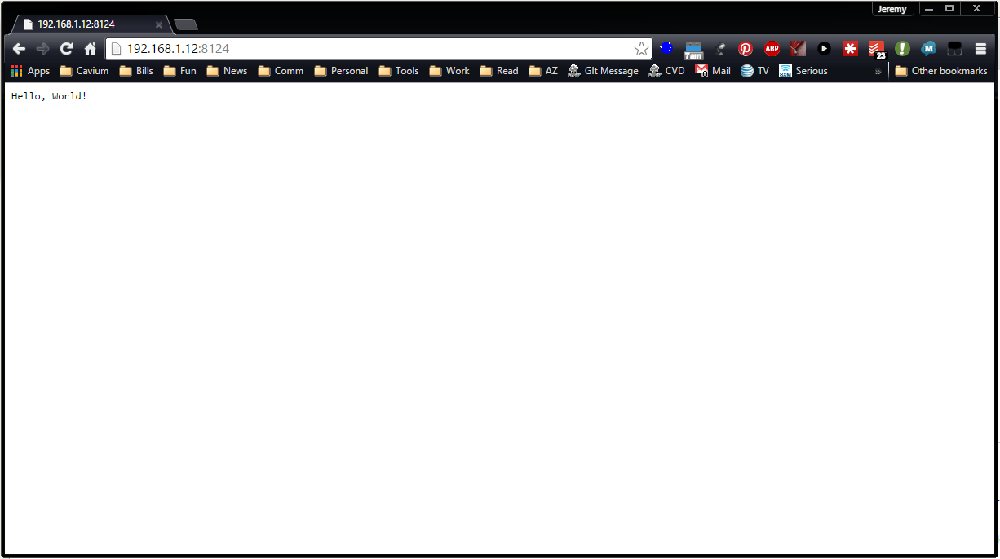

# nodejs hello world

### Sample code from Chaper 1 of [Learning Node](https://yccd.blackboard.com/bbcswebdav/pid-1396561-dt-content-rid-9717023_1/courses/2015MFA-MCSCI-252-5296/Learning%20Node.pdf).
```
// load http module
var http = require('http');
// create http server
http.createServer(function (req, res) {
 // content header
  res.writeHead(200, {'content-type': 'text/plain'});
   // write message and signal communication is complete
    res.end("Hello, World!\n");
    }).listen(8124);
    console.log('Server running on 8124');

```

### Output from running hello.js
```
> node hello.js
Server running on 8124
```

### Output in the browser


