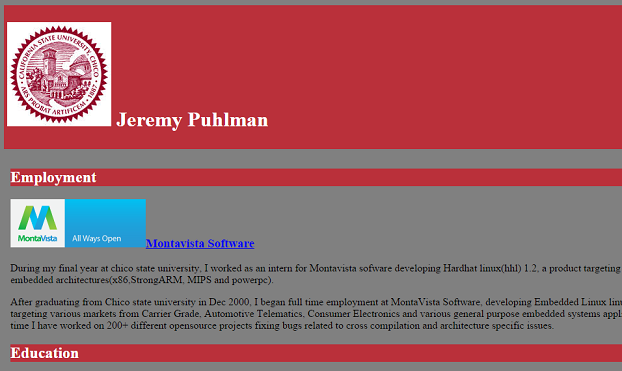
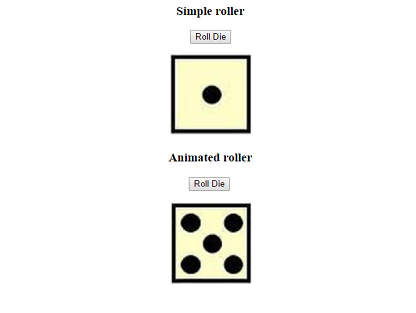
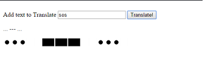
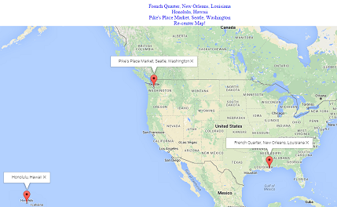
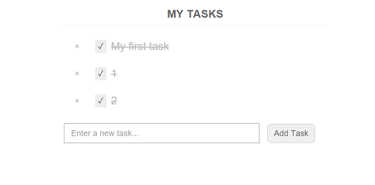

# Porfolio
Each project is provided with a simple explantion of what the porject was about and how it works.
To view the actual project click on the image of the page.

## Simple webpage about my background

## Simple and animated dice roller
In this project we created a java script application to roll a die. The first version was a simple
image projected based on the random value produced by the random number generator. 

The second version uses imagecube and jquery to produce an animation of the die actually rolling to
get to the right value.

## Morris Code translator
In this project we produced a translation of letters to morris code. This is done in three separate
outputs. The first is simple text to show what it should look like. Then it produces SVG rendering of
each dash and dah in time with an audio output of each dash and dah.

## Places I enjoyed visiting
In this project we learned to work with the google maps api. From setting the keys for that access and
the proecess of setting up each pin on the map for the locations. Each of the cities are list above
the map, and selecting the link will zoom the map to the location indicated by the link. 

## Dropbox api example

In this project we took the dropbox sample code to show that were able to setup the dropbox api and host 
the code for the task list example on the external site.

## SQL lite and plain text Access log mapping.

In this project we took an sqlite database that contains the Latitude and Longitude of the ip addresses of those
that accessed the project server, then mapped those values on a google map using the google map api.

